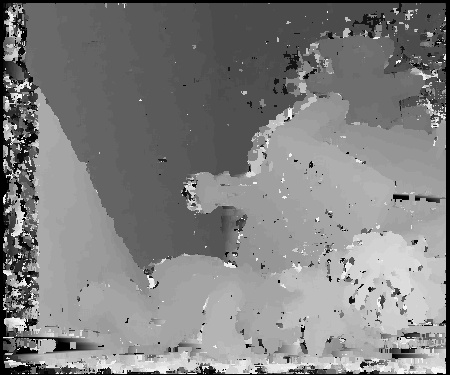
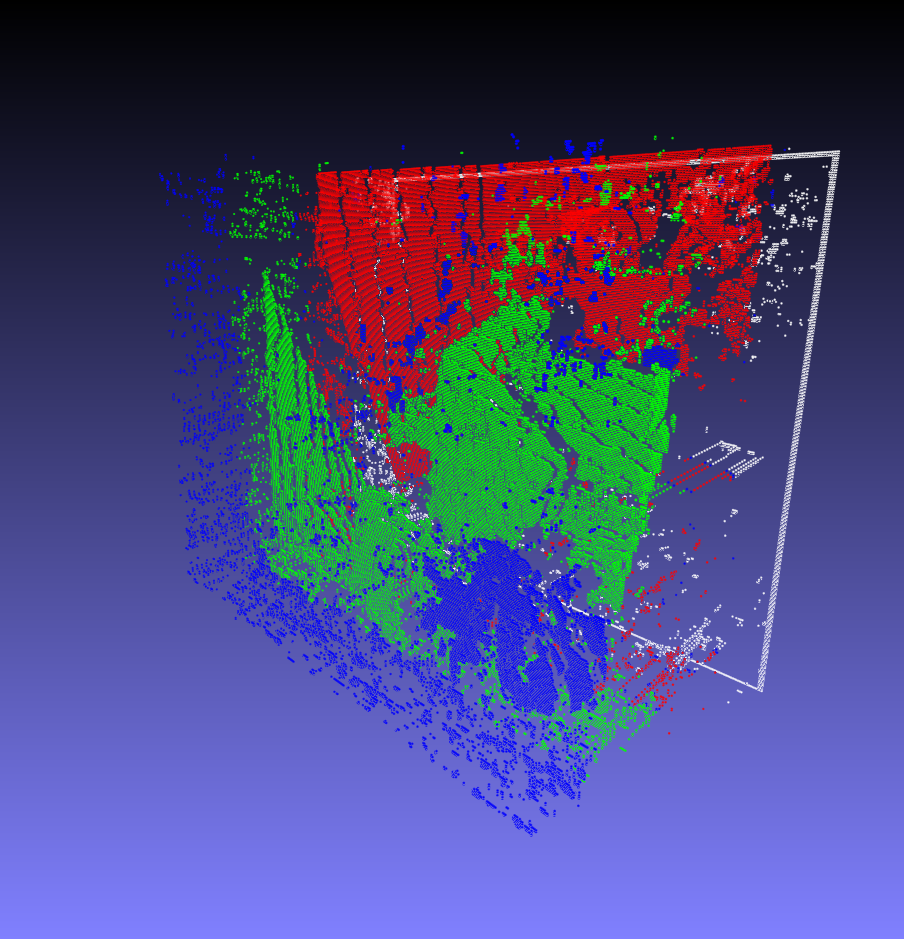

# Image and videoprocessing examples

| directory| description |
|---|---|
|doc/gstreamer.md | GStreamer commandline usage [gstreamer.md](./doc/gstreamer.md) |
|gs |basic sample GStreamer|
|gs01| basic sample GStreamer
|gs02| an example how to structure the gstreamer pipeline
|gs03| basic sample GStreamer (queues)
|guiapp |OpenCV and Qt/Qml combined to change videostreams at runtime
|ocv01 |OpenCV basic example
|papp |a Poco Webserver that processes a video stream
|stereom | Simple stereomatching experiments

# Stereomatching 
some results:

| left image| right image |
|---|---|
|||

depth image:

pointcloud data:

